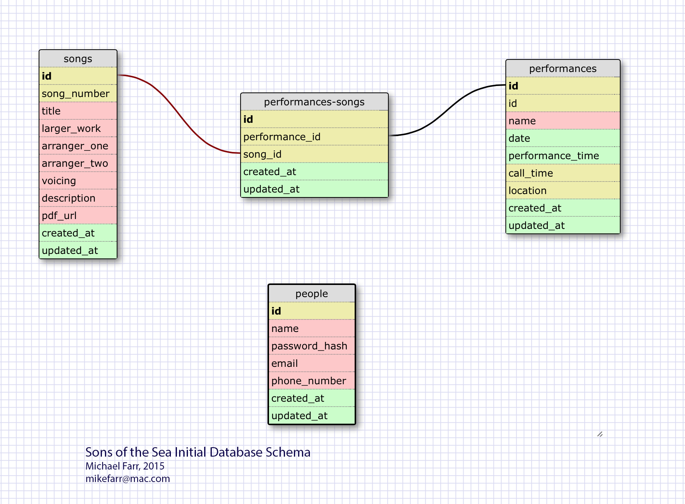
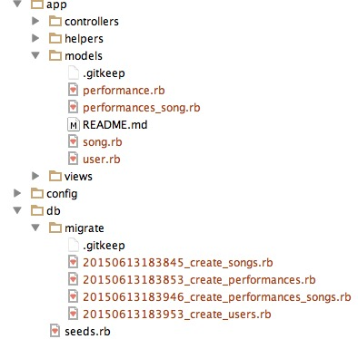

#Creating a Sinatra Web App
Mike Farr <br>
sf-dragonflies-2015

###Prerequisites, you must have:
* **ruby** and **rbenv** installed:
 * QuickRef: [Install_Ruby_rbenv.md](https://github.com/iMikie/DBC-QuickRefs/blob/master/Install_Ruby_rbenv.md)
* **bundler** installed:
  ```
gem install bundler 
  ```
* Created your User Stories.
* Created your database Schema.
  *Here is a sample schema with a many-to-many: performances have many songs, songs may be in many performances.
 <br>

    
 
##Let's get started with Sinatra
1. Clone or fork the Sinatra Skeleton [from this repository] (https://github.com/sf-dragonflies-2015/sinatra-skeleton-mvc-challenge)
 * Not sure how? See [the Git and GitHub section (p. 14) of this QuickRef] (https://github.com/iMikie/DBC-QuickRefs/blob/master/PDFs%20Latest/QuickRefs_Ruby_github_more.pdf)
  
2. Create your own branch (so as to  make sure you don't later accidentally push to master.  Not necessary if you forked from GitHub.)
```sh
    git checkout -b my_branch
```
3. Do a bundle exec to read your Gemfile and install/update any Gems required. 

    ```sh
    bundle exec #within the root directory of the skeleton
    ```
4. From now on all our terminal commands will look like ***bundle exec command***.  This will cause the *command* to be run in the context of the gems (and even their specific versions) mentioned in the Gemfile.  You may want to add this command to your .bash_profile file in your home directory.  This way you can type 'be' instead of 'bundle exec'.

    ```sh
    alias be="bundle exec"
    ```
5. If you are doing this at home, the gem file may complain that it uses a version of ruby that you don't have.  You will have to switch versions of Ruby. If you don't know how to do this see [Install_Ruby_rbenv.md](https://github.com/iMikie/DBC-QuickRefs/blob/master/Install_Ruby_rbenv.md) Once you have rbenv: 
 
    ```sh
    ruby -v                #shows what version of ruby you are running
    rbenv versions         #shows which versions of ruby you have installed
    rbenv install 2.1.0    #install ruby 2.1.0 if you don't have it already
    rbenv local 2.1.0      #switch to 2.1.0 (or whatever version)
    ruby -v                #verify the switch
    ```

6. Following your previously created database schema, let's create some tables.  Note how the names match the schema and are related to each other. This is an ActiveRecord convention and is necessary or your Sinatra and Rails apps will break mysteriously.  Especially take note of the name of the junction (join) table and Model Class for performances-songs.
 
    ```sh
    rake generate:migration NAME='create_songs'
    rake generate:migration NAME='create_performances'
    rake generate:migration NAME='create_performances-songs'
    rake generate:migration NAME='create_users'
    ```
    
7. Now let's create the Model files.  Note the lack of 's' on *PerformancesSong*.

    ```sh
    rake generate:model NAME='Song'              # will create app/models/song.rb
    rake generate:model NAME='Performance'       # will create app/models/song.rb
    rake generate:model NAME='PerformancesSong'  # will create app/models/performances_song.rb, note: NOT: "performances_songs"
    rake generate:model NAME='User'              # will create app/models/song.rb
    ```
    
8. Check out the files in the app/Models and app/db directories that were created for you: <br>


9. Now fill create your table "migrations" using the stubs in **db/migrations** and fill in your model classes in **app/models/** with validations and associations. Here is what the migrations would look like for the above. If this is a mystery, [try this link.](http://edgeguides.rubyonrails.org/active_record_migrations.html)

```ruby
class CreateUsers < ActiveRecord::Migration
  def change
    create_table :users do |t|
      t.string   :username, limit: 50
      t.string   :email, limit: 50
      t.string   :password_hash, limit: 50
      t.string   :phone_number, limit: 24

      t.timestamps
    end
  end
end

class CreatePerformances < ActiveRecord::Migration
  def change
    create_table  :performances do |t|
      t.string    :title, limit: 50
      t.date      :date
      t.time      :performance_time
      t.time      :call_time
      t.string    :location

      t.timestamps

    end
  end
end

class CreatePerformances-songs < ActiveRecord::Migration
  def change
    create_table :performances_songs do |t|
      t.integer  :performance_id
      t.integer  :song_id

      t.timestamps
    end
  end
end
```

8. Here's what the model objects would look like with validations and associations. If this is a mystery, [try this link](http://guides.rubyonrails.org/association_basics.html)

```ruby
class Song < ActiveRecord::Base
  validates :song_number, :presence => true, :uniqueness => true
  validates :title, :presence => true

  has_many :performances_songs
  has_many :performances, :through =>  :performances_songs    #this is how you do a many-to-many
end

class Performance < ActiveRecord::Base  
  validates :title, :presence => true
  validates :date, :presence => true

  has_many :performances_songs             
  has_many :songs, :through =>  :performances_songs           #this is how you do a many-to-many
end

class PerformancesSong < ActiveRecord::Base
  validates :performance_id, :presence => true
  validates :song_id, :presence => true

  belongs_to :performance
  belongs_to :song

end

class User < ActiveRecord::Base
  include BCrypt

  validates :username, :presence => true, :uniqueness => true
  validates :email, :presence => true, :uniqueness => true
  validates :phone_number, :presence => true
  validates :password_hash, :presence => true
end
```

9. Now go ahead and rake your model: do your migrations to actually create the database and your parallel ruby classes.

```sh
be rake db:create
be rake db:migrate
```
